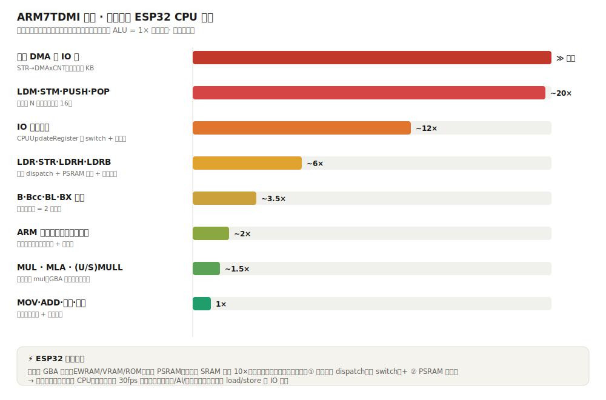
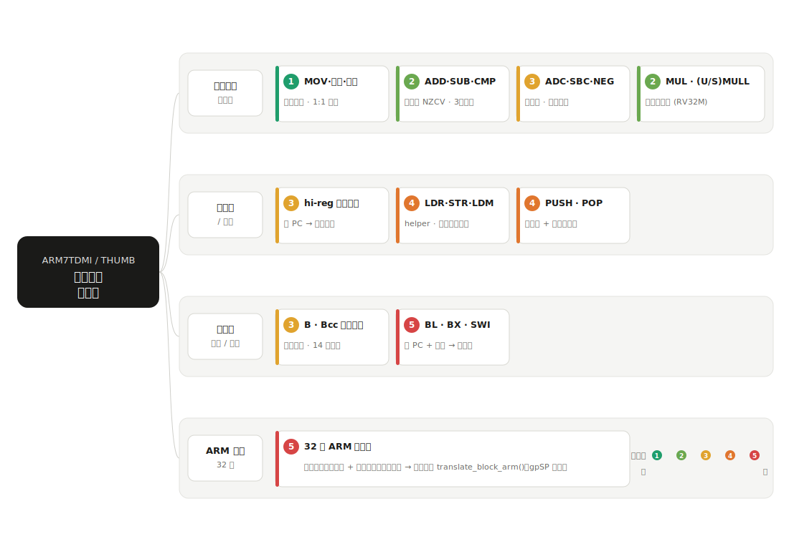

# tab5-vgbanext — VBA-Next GBA emulator for M5Stack Tab5

A standalone GBA emulator for the M5Stack Tab5 (ESP32-P4), built on the
[libretro/vba-next](https://github.com/libretro/vba-next) core instead of mGBA
(see the sibling `tab5-gba` project for the mGBA + dynarec build).

VBA-Next is the GBA core of choice on low-power handhelds: a compact, plain-C
ARM interpreter with aggressive idle-loop speedhacks. This port reuses the whole
Tab5 harness (display / audio / input / file browser) from `tab5-gba` and adds a
thin libretro frontend.

## Layout

```
vba-next/                 upstream core (git clone, unmodified except a ROM-size patch in src/gba.c)
components/
  vbanext/                ESP-IDF wrapper: compiles vba-next src/*.c + libretro/libretro.c
  vgba_run/               the Tab5 frontend (libretro callbacks -> Tab5 harness)
  bsp audio ppa_engine
  gamepad odroid
  file_browser app_common shared harness, copied from tab5-gba
apps/vgba_tab5/           the application (file picker -> vgba_run)
```

## How the core is driven

VBA-Next is a libretro core. Rather than embed a full libretro frontend, we
compile the core together with its `libretro.c` (which supplies `gba_init`,
`set_memory_maps`, per-game save-type autodetect, and the `system*` hooks) and
implement only the five libretro callbacks in `vgba_run.c`:

| callback            | Tab5 side                                            |
|---------------------|------------------------------------------------------|
| environment         | accept RGB565, decline the rest (defaults are fine)  |
| video refresh       | compact `pix` (stride 256) → 240×160, PPA 3× + DSI   |
| audio sample batch  | accumulate 32 kHz stereo → resample 48 kHz → I2S     |
| input poll / state  | read the on-screen vpad / gamepad → libretro buttons |

Main loop: `poll → retro_run() → blit frame → push audio → check MENU`.

## Build / flash

```powershell
. C:\Espressif\frameworks\esp-idf-v5.5.2\export.ps1
cd apps\vgba_tab5
idf.py set-target esp32p4   # first time only
idf.py -p COM4 -b 460800 build flash
```

ESP-IDF 5.5.2, ESP32-P4, 16 MB flash, 32 MB PSRAM. Put `.gba`/`.zip` ROMs on the
SD card.

## Core build switches (components/vbanext/CMakeLists.txt)

`FRONTEND_SUPPORTS_RGB565=1 LOAD_FROM_MEMORY=1 TILED_RENDERING=0 HAVE_NEON=0`
threaded renderer off. `USE_TWEAKS=0` (the idle-loop speedhacks) — flip to `1`
as a performance lever once the baseline is validated on hardware.

## Notes / known work

- **ROM buffer size.** Upstream allocates a flat 32 MB ROM buffer (open-bus fill
  + a fixed SWI trampoline baked into the HLE BIOS at `rom[0x1fe209c]`). A flat
  32 MB will not fit in 32 MB PSRAM alongside framebuffers — the same overflow
  the mGBA port hit. The fix (relocating the trampoline so the buffer can be
  sized to the actual ROM, like mGBA does) lives in `src/gba.c`; see that file
  and the project memory for status.
- Single-core serial loop for now; the emulate/display split used by `tab5-gba`
  can be layered on later (the core hands back a complete frame).
- No real GBA BIOS needed — VBA-Next uses an HLE BIOS.

## ARM7TDMI 指令模拟分析 / Instruction emulation analysis

把 GBA 的 ARM7TDMI/THUMB 指令按两条轴分类 —— 一条是**运行时 ESP32 CPU 开销**（哪类指令模拟最耗 CPU），一条是 **JIT 翻译复杂度**（哪类指令最难写翻译器）。两条轴在「访存类」上闭环：最难翻译的恰好也是最耗 CPU、JIT 收益最小的那类。

### 运行时 CPU 开销（每条指令，相对量级）



ESP32 专属瓶颈：模拟内存（EWRAM/VRAM/ROM）全在 PSRAM，比内部 SRAM 慢约 10×，所以每次访存都吃双份开销 —— ① 内存区域 dispatch（`CPUReadMemory`/`CPUWriteMemory` 的大 switch）+ ② PSRAM 延迟。`LDM/STM/PUSH/POP` 一条做 N 次访存（最多 16），单条最耗；`LDR/STR` 单条 ~6× 但**最频繁**，是一帧总开销的大头；DMA 触发写一条搬几 KB，单条爆发性最高但少。乘法/移位在主机上几乎免费（GBA 的多周期只是 cycle 记账，不产生主机工作量）。`×` 为估算量级，非逐 opcode 实测。

### JIT 翻译复杂度



复杂度由四个驱动因子决定：**标志计算**（NZCV 逐位一致）、**内存副作用**（块内访存的状态同步）、**PC/模式/流水线**（只能在块边界处理）、**主机 ISA 契合度**（如桶形移位 RISC-V 没有）。本仓库的 THUMB→RISC-V dynarec（`components/vgba_jit/`，研究态、默认关闭）主要吃 ① 平凡数据运算那层；访存（状态同步）和 ARM 模式（每条条件执行 + 桶形移位操作数）是收益最小、最难的部分。
